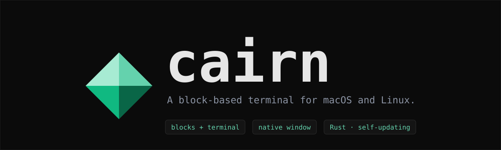
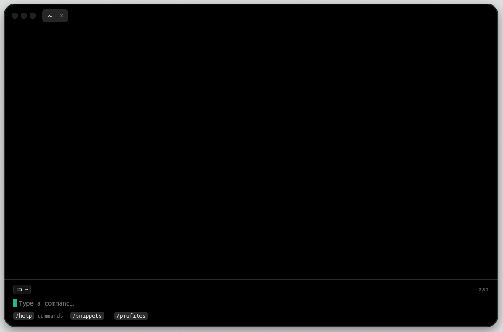

<p align="center">
  
</p>

<p align="center">
  <a href="#install"></a>
  
  <a href="https://github.com/towerforge/cairn/releases/latest"></a>
</p>

<p align="center">
  A terminal that keeps every command as a block: what you ran, what it printed,<br>
  how it exited and how long it took. Native window, 100% Rust, no account, no cloud.
</p>

<p align="center">
  <sub>A cairn is a pile of stones that marks a trail. Cairn stacks your commands the same way.</sub>
</p>

<p align="center">
  
</p>

## Features

- **Blocks.** Every command gets its own block with its output, exit code and
  duration, under a context line such as `~/path git:(branch) 3 • +48 -12` with
  the time on the right.
  `/copy` puts the last output on the clipboard.
- **A real terminal when you need one.** `vim`, `htop`, `less`, `fzf`, `ssh` and
  REPLs take over the whole view while they run; when they exit, you are back to
  blocks.
- **Blocks over ssh.** `ssh host` carries the shell integration with it, so remote
  commands are blocks too.
- **Tabs, profiles and snippets.** Each tab runs its own shell. Startup profiles
  (shell + directory) and snippets live in a plain `config.toml` you can keep in
  your dotfiles.
- **`Tab` completion** of paths, commands and history, built into the prompt.
- **Side editor** with Markdown preview: `edit <file>`.
- **Self-updating** from GitHub releases, each one verified with SHA-256.

## Install

```sh
curl -fsSL https://raw.githubusercontent.com/towerforge/cairn/main/install.sh | sh
```

This works on macOS and Linux:

- **macOS:** installs `Cairn.app` in `/Applications` and a `cairn` command in
  `~/.local/bin`. Open it from Spotlight or Launchpad, or run `cairn`.
- **Linux:** installs the `cairn` binary in `~/.local/bin` and adds a launcher to
  your applications menu. The window needs Vulkan or OpenGL drivers and X11 or
  Wayland.

When a new release is out, Cairn tells you at the bottom of the window; `/update`
installs it.

<details>
<summary><b>Installer details, manual download, building from source, updating</b></summary>

**What the installer does.** `install.sh` detects your OS and architecture,
downloads the matching release from GitHub, checks its SHA-256 and installs it:

- **macOS:** `Cairn.app` goes in `/Applications` (or `~/Applications` if you cannot
  write there), and `~/.local/bin/cairn` links to the binary inside it.
- **Linux:** `cairn` goes in `~/.local/bin`, and `cairn.desktop` and the icon in
  `~/.local/share`. Run as root, everything goes under `/usr/local` instead.

Four variables change its behaviour: `CAIRN_VERSION` (which version),
`CAIRN_INSTALL_DIR` (where the command goes), `CAIRN_APP_DIR` (where the app goes)
and `CAIRN_FORCE=1` (install over an existing Cairn).

**Manual download.** Every release on the
[releases page](https://github.com/towerforge/cairn/releases/latest) has these
archives, plus a `checksums.txt`:

| Platform | Asset | Contents |
|---|---|---|
| macOS Apple Silicon · Intel | `cairn-macos-aarch64.tar.gz` · `cairn-macos-x86_64.tar.gz` | `Cairn.app` |
| Linux x86_64 · ARM64 (glibc 2.35+) | `cairn-linux-x86_64.tar.gz` · `cairn-linux-aarch64.tar.gz` | `cairn`, launcher and icon |

The app is signed ad hoc, not notarized. Installed with `install.sh`, it opens
straight away. If you downloaded the archive with a browser, macOS quarantines it:
open it the first time with right click → Open, or run
`xattr -dr com.apple.quarantine /Applications/Cairn.app`.

**From source** (Rust 1.88 or newer):
`cargo install --git https://github.com/towerforge/cairn`, or from a checkout,
`make install-app` on macOS and `make install-linux` on Linux.

**Updating.** After the first install, Cairn updates itself:

```sh
/update                      # inside Cairn: installs the latest, your tabs keep running
cairn update                 # from a terminal: shows what is new, installs once you confirm
cairn update --check         # only shows what is available
cairn update --to 0.4.0      # installs that exact version, older ones included
```

The update downloads the release for your platform, checks its SHA-256 and swaps it
in place (on macOS, the whole `Cairn.app`, so its signature stays valid). The new
version runs the next time you open Cairn. `-y` skips the confirmation and
`--force` reinstalls the current version. A Cairn built with `cargo install` or from
a checkout is left alone, and you are told how to update it instead. If the install
location is not writable, use `sudo cairn update`.

Once a day, at startup and in the background, Cairn asks GitHub whether there is a
newer release. Set `update_check = false` in `config.toml` to turn this off.

</details>

## How Cairn knows where each command starts and ends

Cairn loads a small shell integration for zsh, bash or fish. It hooks into the
shell's own events (`precmd`/`preexec` in zsh, `PROMPT_COMMAND` + `PS0` in bash, or
the `DEBUG` trap before bash 4.4, and events in fish) and emits two standard escape
sequences: **OSC 133**, which marks the prompt (`A`), the start of the output (`C`)
and the end with its exit code (`D;<exit>`), and **OSC 7**, which reports the
current directory. Prompts and tools that already speak OSC 133 keep working as
they are.

Nothing is ever typed into the command's standard input, so `read`, `sudo`, `ssh`
and REPLs behave normally, and your `.zshrc`, `.bash_profile` or `config.fish` loads
as usual. The generated scripts live in `~/Library/Caches/cairn/shell` on macOS and
`~/.cache/cairn/shell` on Linux. Other shells (`sh`, `dash`, `ksh`) run in a basic
mode that detects the end of each command from `PS1`.

## Interactive sessions and ssh

- **Full terminal.** `ssh`, `mosh`, `telnet`, `docker`/`podman exec -it`,
  `kubectl exec -it`, `sudo -i`, `su`, nested shells and REPLs or database clients
  (`python`, `node`, `psql`, `mysql`, `sqlite3`, `redis-cli`…) get a regular
  terminal for as long as they run, with their own cursor, `Tab` and `Ctrl+R`. The
  mouse wheel scrolls back through the session. `exit` brings back the blocks.
- **Blocks on the server.** `ssh host` runs as `__cairn_ssh host`, which sends the
  server a small script (`remote.sh`, base64-encoded) that starts your shell (zsh,
  bash or fish) with the same hooks. From the first remote prompt on, every command
  is a block with `server:/path` in its context. If the server lacks `sh` or
  `base64`, you get its regular shell as a full terminal. To skip the integration,
  use `command ssh host`, or pass a command: `ssh host uptime`.

## `Tab` completion

Cairn's prompt is its own, not your shell's line editor, so it does its own
completion:

- **Paths**, relative to the tab's directory, plus `~` and absolute paths. Names
  with spaces work, escaped or in quotes. After `cd` only folders are offered, and
  hidden ones only once you type the leading `.`.
- **Commands** from your login shell's `PATH`, plus builtins, as the first word or
  after `|`, `;`, `&&`, `sudo`…
- **History**: when no path or command matches, earlier commands that start the
  same way.

A single match is completed in full (with a trailing `/` for a folder). Several
matches complete their common part and open a list: `Tab`/`⇧Tab` or `↑↓` move
through it, `↵` accepts, `Esc` closes. With an empty prompt and the editor open,
`Tab` moves focus to the editor.

Completion is off in remote sessions, where it would suggest local files, and it
does not know program-specific completions such as git branches or docker options.

## `/` commands

Type `/` at the prompt to open the command list above it. It filters as you type:
`↑↓` to move, `Tab` to complete, `↵` to run, `Esc` to close.

| Command | Action |
|---|---|
| `/help` | version, commands, shortcuts and where your files are |
| `/history` | command history |
| `/new` · `/close` | new tab · close tab |
| `/editor [file]` | open a file · show or hide the editor |
| `/snippets` · `/profiles` | snippets · startup profiles |
| `/clear` | clear the blocks |
| `/copy` | copy the last output |
| `/update` | install the latest release |
| `/quit` | quit |

## Shortcuts

Every Cairn shortcut starts with one prefix, **`Ctrl+G`**, so all other keys go
straight to your shell or program.

| `Ctrl+G` + | Action | `Ctrl+G` + | Action |
|---|---|---|---|
| `t` | new tab | `h` | history |
| `w` | close tab | `s` | snippets |
| `n` / `p` | next / previous tab | `r` | profiles |
| `1`–`9` | go to tab | `e` | show / hide editor |
| `Tab` | focus terminal ↔ editor | `k` | clear blocks |
| `y` | copy the last output | `g` | send `^G` to the program |
| `q` | quit | | |

- **At the prompt:** `↑`/`↓` browse the tab's history, `Ctrl+R` searches all of it,
  `PgUp`/`PgDn` scroll, `Ctrl+L` clears, and `Ctrl+D` on an empty prompt closes the
  tab.
- **While a command runs:** the keyboard belongs to the program; `Shift+PgUp/PgDn`
  scrolls.
- **In the editor:** `Ctrl+S` saves, `Ctrl+P` toggles the Markdown preview,
  `Ctrl+X` closes the editor and `Esc` returns to the terminal.

<details>
<summary><b>Window shortcuts</b></summary>

| macOS | Linux | Action |
|---|---|---|
| `Cmd+C` | `Ctrl+Shift+C` | copy the selection |
| `Cmd+V` | `Ctrl+Shift+V` | paste |
| `Cmd+T` / `Cmd+W` | `Ctrl+Shift+T/W` | new tab / close tab |
| `Cmd+1`–`9`, `Cmd+[` / `]` | `Ctrl+Shift+…` | switch tab |
| `Cmd+K` | `Ctrl+Shift+K` | clear blocks |
| `Cmd+S` / `R` / `E` | `Ctrl+Shift+…` | snippets / profiles / editor |
| `Cmd+=` / `Cmd+-` / `Cmd+0` | `Ctrl+=` / `-` / `0` | zoom in / out / reset |
| `Cmd+Q` | `Ctrl+Shift+Q` | quit |

Drag with the mouse to select text, in blocks and in the full terminal alike, and
copy it with `Cmd+C`. If the program uses the mouse itself, hold `Shift` (or
`Option` on macOS) while dragging. On macOS, `Option` types the characters of your
keyboard layout (`@`, `#`, `[`, `|`… on a Spanish one) instead of acting as `Meta`.

</details>

## Where your data lives

Cairn uses the same XDG layout on macOS and Linux, and honours `XDG_CONFIG_HOME`,
`XDG_DATA_HOME` and `XDG_STATE_HOME`. `cairn --help` and `/help` print the actual
paths.

| What | Where |
|---|---|
| Startup profiles, snippets, settings | `~/.config/cairn/config.toml` |
| History | `~/.local/share/cairn/history.jsonl` |
| Last update check | `~/.local/state/cairn/update-check.json` |

`config.toml` is meant to be edited by hand and kept in your dotfiles. Profiles are
keyed by name and snippets by label. Cairn rewrites the whole file when you add or
delete one from the app, so comments are not preserved.

```toml
update_check = true        # ask GitHub for new releases once a day
default_profile = "work"   # the first tab opens with this profile

[[profiles]]
name = "work"
shell = "/bin/zsh"
cwd = "~/work"

[[snippets]]
label = "logs"
command = "make logs"
```

History is stored as one JSON line per command (`command`, `ts`, `cwd`, `profile`),
keeping the last 10,000.

**Upgrading from Prism**, Cairn's earlier name: on first start, Cairn moves
`~/.config/prism`, `~/.local/share/prism` and `~/.local/state/prism` to their
`cairn` equivalents, unless those already exist. The SQLite database used by
versions up to 0.3 (`prism.db`) is imported as well, then kept as `prism.db.bak`.

## License

[MIT](LICENSE)
